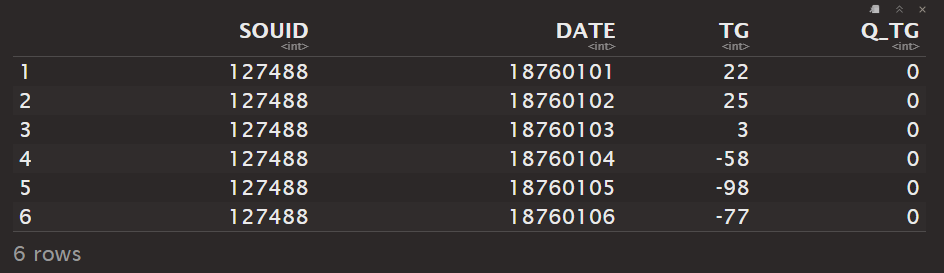
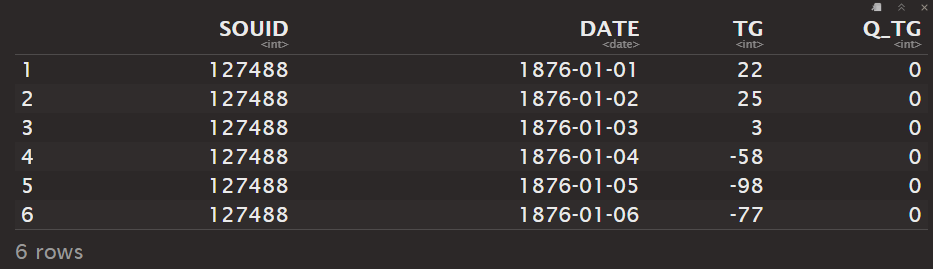
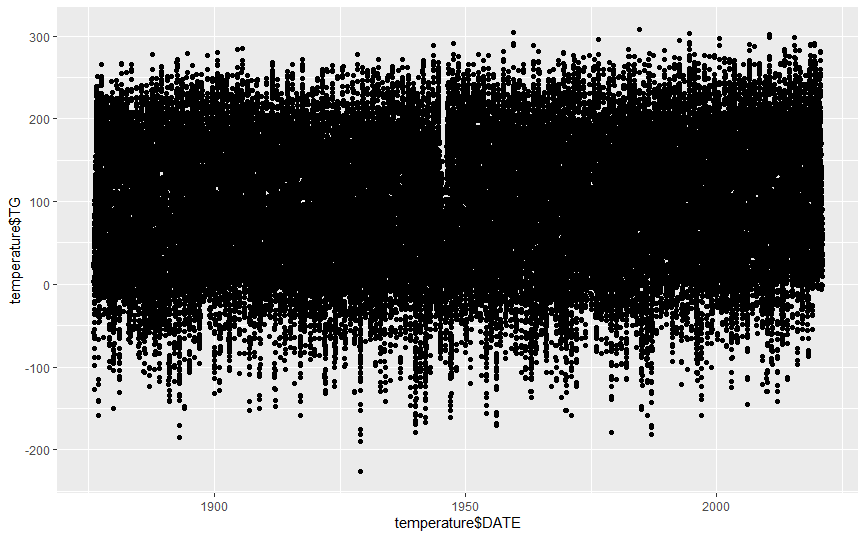
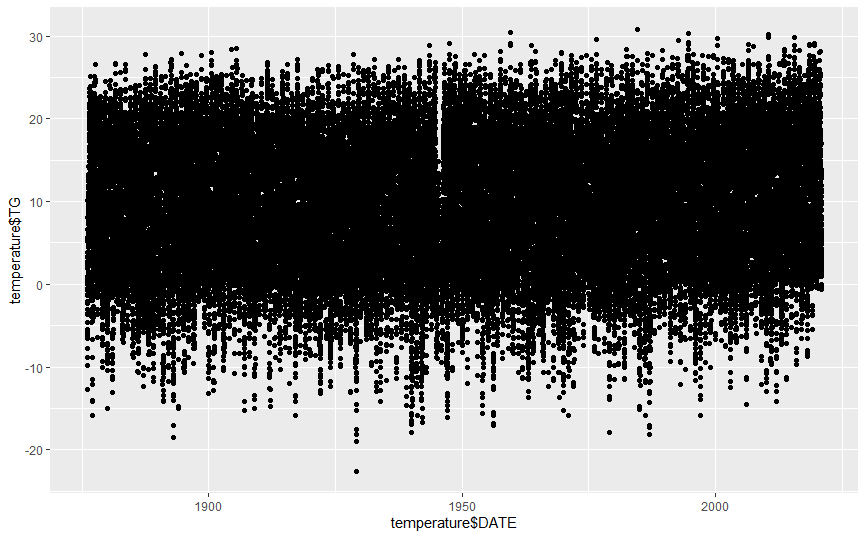
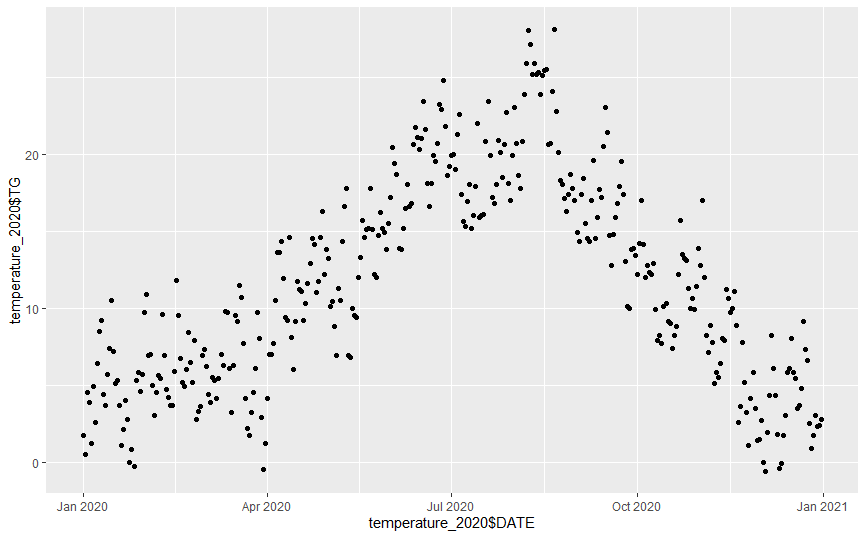
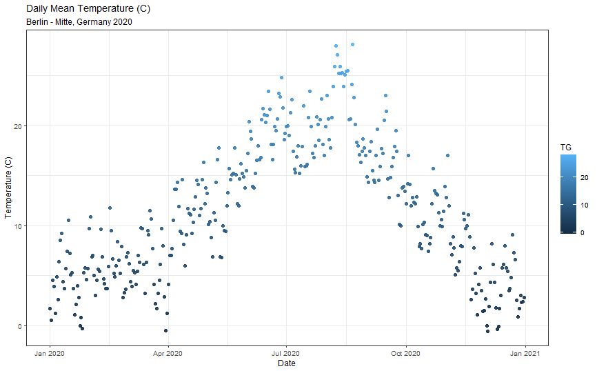

# Berlin Mitte Daily Precipitation and Mean Temperature
## Data source: <https://www.ecad.eu/dailydata/index.php>

## Load ggplot2 package for visualization
```{r}
library(ggplot2)
```

## Read text file
```{r}
## Make first line as header of table
## Separate by ,
## Skip first 18 lines
## Clean missing value
temperature <- read.csv("Mean-Temperature/TG_STAID004563.txt", header = TRUE, sep = ",", skip = 18, na.strings = c("NA", " ", "-9999"))
```

## Display structure of the object
```{r}
str(temperature)
```
    Show in New WindowClear OutputExpand/Collapse Output
    'data.frame':	52961 obs. of  4 variables:
    $ SOUID: int  127488 127488 127488 127488 127488 127488 127488 127488     127488 127488 ...
    $ DATE : int  18760101 18760102 18760103 18760104 18760105 18760106      18760107 18760108 18760109 18760110 ...
    $ TG   : int  22 25 3 -58 -98 -77 -66 -89 -127 -89 ...
    $ Q_TG : int  0 0 0 0 0 0 0 0 0 0 ...

## Check the first few lines of dataframe
```{r}
head(temperature)
```
<!-- -->

    

## Date Conversion from interger
```{r}
temperature$DATE = as.Date(as.character(temperature$DATE), format='%Y%m%d')

class(temperature$DATE)
# "Date"

head(temperature)
```
<!-- -->


## Quick plot
```{r}
qplot(x = temperature$DATE,
      y = temperature$TG)
```
<!-- -->


## Mean temperature from data = 0.1 * TG
```{r}
temperature$TG = temperature$TG * 0.1

# From "integer" to "numeric" class
class(temperature$TG)
# "numberic"

qplot(x = temperature$DATE,
      y = temperature$TG)

```
<!-- -->


## Data start from
```{r}
min(temperature$DATE)
```
    [1] "1876-01-01"

## Data end on
```{r}
max(temperature$DATE)
```
    [1] "2020-12-31"


# Replicate data from year 2020
```{r}
temperature_2020 = temperature[temperature$DATE >= "2020-01-01" & temperature$DATE <= "2020-12-31",]

qplot(x = temperature_2020$DATE,
      y = temperature_2020$TG)

```
<!-- -->

## Plot with ggplot

```{r}
ggplot(data = temperature_2020,  aes(x = DATE, y = TG)) +
    geom_point(alpha = 0.9, aes(color = TG)) +
    labs(x = "Date",
      y = "Temperature (C)",
      title = "Daily Mean Temperature (C)",
      subtitle = "Berlin - Mitte, Germany 2020") + theme_bw(base_size = 9)
```

<!-- -->


## Reset rownames
```{r}
nrow(temperature_2020)
# 366

rownames(temperature_2020) <- 1:nrow(temperature_2020)
```

## minimum temperature of year 2020
```{r}
min(temperature_2020$TG)
# -0.6

# which row has temperature of -0.6
which(temperature_2020$TG == min(temperature_2020$TG))

# Show detail of row 338
temperature_2020[338,]

```

<!-- -->


# This one line code provide the same result
```{r}
temperature_2020[which(temperature_2020$TG == min(temperature_2020$TG)),]

```
<!-- -->


